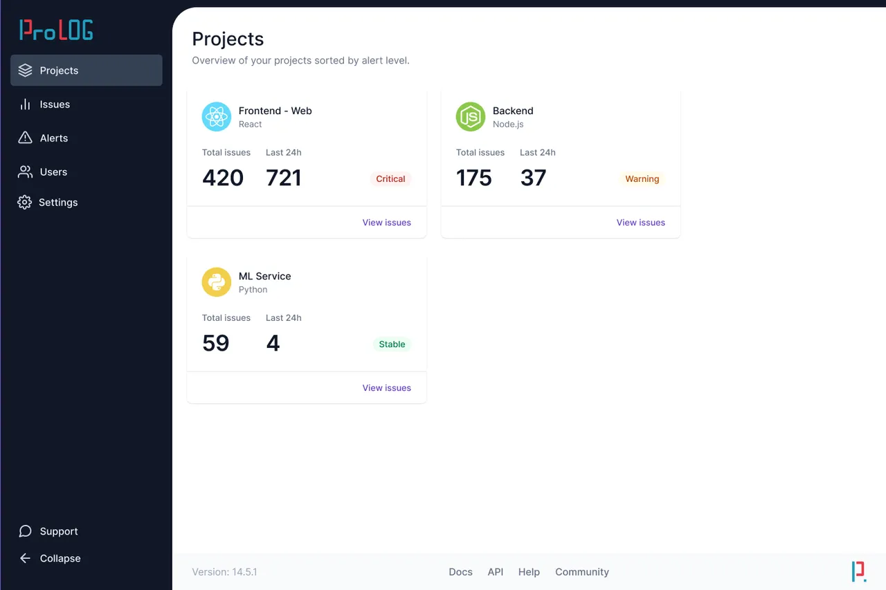

리액트 폴더 구조는 서로 다른 접근 방법 때문에 수년간 논쟁 되고 있습니다. 그로 인해 개발자들은 “파일을 어디에 넣어야 할까?” “코드는 어떻게 정리하지?”라고 의문을 가집니다.

리액트 프로젝트를 구성하는데 가장 유명한 방법은 다음과 같습니다:

- 컴포넌트, 컨텍스트, 훅과 같은 파일 유형별로 그룹화
- 컨텍스트, 훅 등을 위한 전역 폴더와 페이지별로 그룹화
- 관련 컴포넌트, 컨텍스트, 훅을 같은 위치에 배치하며 페이지별로 그룹화
- 기능별로 그룹화

이 글은 커져가는 코드에서 폴더 구조가 어떻게 발전하는지, 그로인해 초래할 수 있는 문제점, 모범 사례, 그리고 [React Job Simulator](https://profy.dev/)의 디자인을 기능 기반(feature-based) 폴더 구조로 바꾸는 도전에 대해 탐구합니다.

> 기능 기반 폴더 구조의 최종 예제 프로젝트는 [이 GitHub 저장소](https://github.com/profydev/prolog-app/)에서 확인할 수 있습니다.

우리는 모든 세부 사항이 아닌 큰 그림에 중점을 둘 것입니다. 이 이야기를 더 흥미롭게 만들고 이러한 개념을 설명하기 위해 우리는 차세대 대박상품(할 일 앱)을 만드는 가상의 스타트업의 (약간의 풍자적인) 여정을 따라갈 것입니다.

### 목차

- [프로토타입: 파일 유형별 그룹화](#프로토타입-파일-유형별-그룹화)
- [투자: 더 많은 파일 → 중첩](#투자-더-많은-파일-→-중첩)
- [성장: 우리는 페이지가 필요해](#성장-우리는-페이지가-필요해)
- [세계 정복: 같은 장소 배치(Colocation)](#세계-정복-같은-장소-배치colocation)
- [탈출: 기능별로 그룹화하기](#탈출-기능별로-그룹화하기)
- [토론: 기능 기반 폴더 구조와 스크리밍 아키텍처](#토론-기능-기반-폴더-구조와-스크리밍-아키텍처)
- [모범 사례](#모범-사례)
  - [절대 경로](#절대-경로)
  - [Public API로써 index.js](#public-api로써-indexjs)
  - [파일과 폴더 이름을 위한 케밥 케이스](#파일과-폴더-이름을-위한-케밥-케이스)
- [도전: 디자인을 기반으로 프로젝트 구조화하기](#도전-디자인을-기반으로-프로젝트-구조화하기)

## 프로토타입: 파일 유형별 그룹화

우리 스타트업은 큰 비전을 가지고 있습니다: 분열, 세계 정복, 알다시피 그런 것들이죠. 하지만 우리는 작게 시작합니다. 첫 번째 버전에는 **간단한 할 일 목록**만으로도 충분할 것입니다.

[React 문서](https://legacy.reactjs.org/docs/faq-structure.html#dont-overthink-it)에 따르면 폴더 구조를 결정하는 데 5분 이상 소요되어서는 안 된다고 합니다. 그리고 문서에서 가장 간단한 해결책은 "파일 유형별로 그룹화" 방식입니다. 컴포넌트는 `components` 폴더에, 훅은 `hooks` 폴더에, 그리고 컨텍스트는 `contexts` 폴더에 들어갑니다. 우리는 스타일, 테스트 등을 포함하여 각각의 컴포넌트 폴더를 생성합니다.

```shell
└── src/
    ├── components/
    │   │   # 대부분의 폴더 내부 파일은 가독성을 위해 생략하겠습니다
    │   ├── button/
    │   ├── card/
    │   ├── checkbox/
    │   ├── footer/
    │   ├── header/
    │   ├── todo-item/
    │   └── todo-list/
    │       ├── todo-list.component.js
    │       └── todo-list.test.js
    ├── contexts/
    │   │   # 이게 무슨 역할인지 모르겠지만, 이 폴더를 비워둘 수는 없었습니다.
    │   └── todo-list.context.js
    └── hooks/
        │   # 또 이게 무슨 역할인지 모르겠지만, 이 폴더를 비워둘 수는 없었습니다.
        └── use-todo-list.js
```

이것은 초보자들이 시작하기에 간단하고 복잡하지 않은 방법입니다. 그러나 이것이 오래 간단하게 유지되지는 않을 것입니다.

## 투자: 더 많은 파일 → 중첩

투자자들에게 인상을 주기 위해 새로운 기능을 추가해야 합니다. 그래서 우리는 **할 일 항목을 편집하는 기능을 지원하기**로 결정했습니다. 할 일을 편집하기 위한 폼(form)을 추가하고, 그 폼을 표시하기 위한 모달을 추가했습니다.

```shell
└── src/
    ├── components/
    │   ├── button/
    │   ├── card/
    │   ├── checkbox/
    │   │   # 이 모달은 할 일 항목을 편집하기 위한 폼을 보여줍니다.
    │   ├── edit-todo-modal/
    │   ├── footer/
    │   ├── header/
    │   ├── modal/
    │   ├── text-field/
    │   │   # todo-form은 모달에 의해 보여지는 폼입니다.
    │   ├── todo-form/
    │   ├── todo-item/
    │   │   # 편집 모달(edit-todo-modal)은 할 일 목록 위에 표시됩니다.
    │   └── todo-list/
    │       ├── todo-list.component.js
    │       └── todo-list.test.js
    ├── contexts/
    │   ├── modal.context.js
    │   └── todo-list.context.js
    └── hooks/
        ├── use-modal.js
        ├── use-todo-form.js
        └── use-todo-list.js

```

컴포넌트 폴더가 복잡해지고 있습니다. 컴포넌트를 그룹화하고 같은 위치에 배치시켜 보려고 합니다:

```shell
└── src/
    ├── components/
    │   ├── edit-todo-modal/
    │   │   ├── edit-todo-modal.component.js
    │   │   ├── edit-todo-modal.test.js
    │   │   │   # 같은 장소에 배치하세요 -> todo-form은 edit-todo-modal에서만 사용됩니다
    │   │   ├── todo-form.component.js
    │   │   └── todo-form.test.js
    │   ├── todo-list/
    │   │   │   # 같은 장소에 배치하세요 -> todo-item은 todo-list에서만 사용됩니다
    │   │   ├── todo-item.component.js
    │   │   ├── todo-list.component.js
    │   │   └── todo-list.test.js
    │   │   # 간단한 ui 컴포넌트들은 하나의 폴더로 그룹화 하세요
    │   └── ui/
    │       ├── button/
    │       ├── card/
    │       ├── checkbox/
    │       ├── footer/
    │       ├── header/
    │       ├── modal/
    │       └── text-field/
    ├── contexts/
    │   ├── modal.context.js
    │   └── todo-list.context.js
    └── hooks/
        ├── use-modal.js
        ├── use-todo-form.js
        └── use-todo-list.js
```

이 구조는 자식 컴포넌트와 부모 컴포넌트를 함께 위치시키고 일반적인 UI 컴포넌트를 `ui` 폴더에 그룹화함으로써 더 나은 개요를 제공합니다.

폴더를 접으면 더 깔끔한 구조가 명확해집니다:

````shell
└── src/
    ├── components/
    │   ├── edit-todo-modal/
    │   ├── todo-list/
    │   └── ui/
    ├── contexts/
    └── hooks/
    ```
````

## 성장: 우리는 페이지가 필요해

우리 스타트업은 계속 성장하고 있습니다. 우리는 대중들에게 앱을 출시하고 소수의 사용자들이 있습니다. 물론, 그들은 바로 불평하기 시작합니다. 그 중에서 가장 중요한 것은:

우리 사용자들은 스스로 할 일 항목을 만들고 싶어합니다!

그래서 우리는 폼(form)을 통해 할 일을 생성하기 위한 두 번째 페이지를 추가합니다. 다행히 기존의 할 일 편집 폼을 재사용할 수 있습니다. 이는 놀라운 일입니다. 개발팀의 귀중한 자원을 절약할 수 있기 때문이죠.

우리는 또한 사용자 인증이 필요하고 공유된 할 일 폼을 다시 `components` 폴더로 이동해야 합니다.

```shell
└── src/
    ├── components/
    │   │   # 우리는 이제 여러 페이지를 가집니다
    │   ├── create-todo-page/
    │   ├── edit-todo-modal/
    │   ├── login-page/
    │   │   # todo-list가 현재 보여지는 곳입니다
    │   ├── home-page/
    │   ├── signup-page/
    │   │   # 폼은 이제 create-todo-page와 edit-todo-modal에서 사용됩니다
    │   ├── todo-form/
    │   ├── todo-list/
    │   │   ├── todo-item.component.js
    │   │   ├── todo-list.component.js
    │   │   └── todo-list.test.js
    │   └── ui/
    ├── contexts/
    │   ├── modal.context.js
    │   └── todo-list.context.js
    └── hooks/
        │   # 인증을 다룹니다
        ├── use-auth.js
        ├── use-modal.js
        ├── use-todo-form.js
        └── use-todo-list.js

```

지금의 폴더 구조에 대해 어떻게 생각하시나요? 몇 가지 문제점이 있습니다.

첫째, `components` 폴더가 너무 복잡해지고 있지만, 구조를 평평하게 유지하면서 이 문제를 피할 수 없습니다. 그래서 이 문제는 무시합시다.

둘째 (그리고 더 중요한 문제), `components` 폴더에는 다양한 컴포넌트들이 섞여 있습니다:

- 페이지 (앱의 진입점, 새로운 개발자에게 중요)
- 부수효과가 있을 수 있는 복잡한 컴포넌트 (예: 폼)
- 버튼과 같은 간단한 UI 컴포넌트.

**해결책: 별도의 `pages` 폴더를 생성합니다. 모든 페이지 컴포넌트와 그 하위 컴포넌트를 그곳으로 이동합니다. 여러 페이지에서 사용되는 컴포넌트만 `components` 폴더에 유지합니다.**

```shell
└── src/
    ├── components/
    │   │   # 폼은 home과 create todo page에서 보여집니다
    │   ├── todo-form/
    │   │   # 또한 폴더 구조를 평평하게 하기 위해 `components` 폴더를 그룹화하지 않을 수도 있습니다
    │   └── ui/
    ├── contexts/
    │   ├── modal.context.js
    │   └── todo-list.context.js
    ├── hooks/
    │   ├── use-auth.js
    │   ├── use-modal.js
    │   ├── use-todo-form.js
    │   └── use-todo-list.js
    └── pages/
        ├── create-todo/
        ├── home/
        │   ├── home-page.js
        │   │   # 같은 장소에 배치하세요 -> edit-todo-modal은 오직 home page에서만 사용합니다
        │   ├── edit-todo-modal/
        │   └── todo-list/
        │       ├── todo-item.component.js
        │       ├── todo-list.component.js
        │       └── todo-list.test.js
        ├── login/
        │   # 법적인 사항도 잊지 마세요 :)
        ├── privacy/
        ├── signup/
        └── terms/
```

더 깔끔해진 이 구조는 새로운 개발자가 전체 페이지를 식별하는데 도움을 주고 코드를 살펴 보거나 디버깅을 위한 진입점을 제공합니다. 많은 개발자들이 [Tania Rascia](https://www.taniarascia.com/react-architecture-directory-structure/)와 [Max Rozen](https://maxrozen.com/guidelines-improve-react-app-folder-structure) 처럼 이와 비슷한 구조를 사용합니다.

하지만 우리 스타트업은 세계 정복을 목표로 하고 있습니다. 여기서 멈춰서는 안 됩니다.

## 세계 정복: 같은 장소 배치(Colocation)

우리 할 일 앱은 이제 별점 5개를 자랑하는 최고의 앱이 되었습니다. 뿐만아니라 우리 팀과 코드도 성장하면서 몇 가지 도전과제에 직면하게 되었습니다.

```shell
└── src/
    ├── components/
    ├── contexts/
    │   ├── modal.context.js
    │   ├── ...  # 여기 더 많은 컨텍스트가 있다고 상상하세요
    │   └── todo-list.context.js
    ├── hooks/
    │   ├── use-auth.js
    │   ├── use-modal.js
    │   ├── ...  # 더 많은 훅도 있다고 상상하세요
    │   ├── use-todo-form.js
    │   └── use-todo-list.js
    └── pages/
```

전역 `hooks`와 `contexts` 폴더는 복잡해졌습니다. 그리고 복잡한 컴포넌트의 코드들이 여러 폴더에 걸쳐 존재하기 때문에 의존성을 추적하기에 더 어려워집니다.

**우리의 해결책: 같은 장소 배치(colocation)! 가능한 경우 컴포넌트 옆에 컨텍스트와 훅을 이동시킵니다.**

```shell
└── src/
    ├── components/
    │   ├── todo-form/
    │   └── ui/
    ├── hooks/
    │   │   # hooks 폴더에는 이제 파일이 충분히 남아있지 않습니다
    │   └── use-auth.js
    └── pages/
        ├── create-todo/
        ├── home/
        │   ├── home-page.js
        │   ├── edit-todo-modal/
        │   └── todo-list/
        │       ├── todo-item.component.js
        │       ├── todo-list.component.js
        │       ├── todo-list.context.js
        │       ├── todo-list.test.js
        │       │   # 같은 장소에 배치하세요 -> 이 훅은 오직 todo-list 컴포넌트에서만 사용합니다
        │       └── use-todo-list.js
        ├── login/
        ├── privacy/
        ├── signup/
        └── terms/
```

우리는 전역 `contexts` 폴더를 제거하고 전역 `hooks` 폴더는 `use-auth`만 남아있습니다.
이 구조는 기능에 속한 모든 파일을 한 번에 파악할 수 있게 합니다.

하지만 여전히 이슈가 있습니다:

1. "todo" 엔티티 코드가 여러 폴더에 존재하는 점
2. `todo-list` 컴포넌트가 `home` 폴더에 있는 건 명확하지 않는 점

```shell
└── src/
    ├── components/
    ├── hooks/
    └── pages/
        ├── create-todo/
        ├── home/
        ├── login/
        ├── privacy/
        ├── signup/
        └── terms/
```

## 탈출: 기능별로 그룹화하기

우리가 수십억 달러의 스타트업을 팔면서, 사용자들은 새로운 기능을 요구합니다. 그들은 할 일 항목에 대해 별도의 프로젝트(예: 업무 및 식료품 목록과 같은)를 원합니다. 우리는 "프로젝트" 엔터티를 추가하고 페이지와 컴포넌트에 변경을 가합니다.

```shell
└── src/
    ├── components/
    │   ├── todo-form/
    │   │   # todo-list는 이제 home and project page에서 사용됩니다
    │   ├── todo-list/
    │   │   ├── todo-item.component.js
    │   │   ├── todo-list.component.js
    │   │   ├── todo-list.context.js
    │   │   ├── todo-list.test.js
    │   │   └── use-todo-list.js
    │   └── ui/
    └── pages/
        ├── create-project/
        ├── create-todo/
        │   # projects 목록과 todos 전체 개요를 보여줍니다
        ├── home/
        │   ├── index.js
        │   ├── edit-todo-modal/
        │   └── project-list/
        ├── login/
        ├── privacy/
        │   # project에 속한 todos 목록을 보여줍니다
        ├── project/
        ├── signup/
        └── terms/
```

이 구조는 꽤 깔끔해보이지만 이슈가 있습니다:

- `pages`폴더에서 이 앱이 todos, projects, users를 가지고있는 것은 명확하지 않습니다. 우리의 두뇌는 먼저 `create-todo` (todo 엔티티)나 `login` (user 엔티티)과 같은 폴더 이름을 처리하고, 중요하지 않은 것들 (예: 개인정보 보호 및 약관)과 구분해야 합니다.
- 사용 기반으로 공유 `components` 폴더에 컴포넌트를 배치하는 것은 임의적으로 느껴집니다. 컴포넌트를 찾기 위해 어디에서 그리고 몇 번 컴포넌트가 사용되는지 알아야 합니다.
-

폴더 구조를 조정하고 **기능별로 파일을 그룹화**합시다.

"기능"은 광범위한 용어입니다. 이 경우에는 엔터티(`todo`, `project`, `user`)를 사용하고 버튼, 폼 필드 등과 같은 컴포넌트를 위한 `ui` 폴더를 사용할 것입니다.

```shell
└── src/
    ├── features/
    │   │    # todo "기능"은 할 일과 관련된 모든 것을 포함합니다
    │   ├── todos/
    │   │   │   # index.js는 export를 위해 사용합니다. (잠시 후에 더 자세히 설명하겠습니다)
    │   │   ├── index.js
    │   │   ├── create-todo-form/
    │   │   ├── edit-todo-modal/
    │   │   ├── todo-form/
    │   │   └── todo-list/
    │   │       │   # todo-list 컴포넌트와 hook을 export합니다.
    │   │       ├── index.js
    │   │       ├── todo-item.component.js
    │   │       ├── todo-list.component.js
    │   │       ├── todo-list.context.js
    │   │       ├── todo-list.test.js
    │   │       └── use-todo-list.js
    │   ├── projects/
    │   │   ├── index.js
    │   │   ├── create-project-form/
    │   │   └── project-list/
    │   ├── ui/
    │   │   ├── index.js
    │   │   ├── button/
    │   │   ├── card/
    │   │   ├── checkbox/
    │   │   ├── header/
    │   │   ├── footer/
    │   │   ├── modal/
    │   │   └── text-field/
    │   └── users/
    │       ├── index.js
    │       ├── login/
    │       ├── signup/
    │       └── use-auth.js
    └── pages/
        │   # 페이지 폴더에 남아 있는 것은 간단한 JS 파일뿐입니다
        │   # 각 파일은 페이지를 나타냅니다(Next.js 처럼)
        ├── create-project.js
        ├── create-todo.js
        ├── index.js
        ├── login.js
        ├── privacy.js
        ├── project.js
        ├── signup.js
        └── terms.js
```

각 폴더에 "배럴 파일" 또는 모듈 또는 컴포넌트의 "Public API"로 `index.js` 파일을 도입합니다. 이 새로운 "기능별 그룹화" 폴더 구조는 이전의 문제점을 해결합니다.

## 토론: 기능 기반 폴더 구조와 스크리밍 아키텍처

Bob Martin의 글 [스크리밍 아키텍처](https://blog.cleancoder.com/uncle-bob/2011/09/30/Screaming-Architecture.html)에서는 아키텍처가 독자에게 사용된 프레임워크가 아닌 시스템에 대해 알려야 한다고 말했습니다. 우리의 초기 폴더 구조는 파일을 유형별로 그룹화했습니다:

```shell
└── src/
    ├── components/
    ├── contexts/
    └── hooks/
```

이것은 "나는 React 앱이야."라고 외칩니다. 반면에, 우리의 최종 특징 기반 폴더 구조는:

```shell
└── src/
    ├── features/
    │   ├── todos/
    │   ├── projects/
    │   ├── ui/
    │   └── users/
    └── pages/
        ├── create-project.js
        ├── create-todo.js
        ├── index.js
        ├── login.js
        ├── privacy.js
        ├── project.js
        ├── signup.js
        └── terms.js
```

이것은 "안녕, 나는 프로젝트 관리 도구야"라고 말하며, Bob Martin의 비전과 일치합니다.

또한, 이 구조는 두 개의 진입점(features 또는 pages)을 제공하여 새로운 개발자들이 코드베이스를 배우기 쉽게 만듭니다. 게다가 전역 컨텍스트와 훅 폴더를 제거하여 잠재적인 덤프 장소(불필요한 파일이나 코드가 쌓이는 곳)를 줄입니다.

우리의 폴더 구조는 깔끔하고, 설명적이며, 유연합니다. 특징 기반의 폴더 구조로 시작하는 것은 앱을 장기적으로 조직화하는 데 도움이 될 수 있습니다.

더 자세한 기능 기반 폴더 구조 내용은 아래를 살펴보세요:

- [Bulletproof 리액트 소스코드](https://github.com/alan2207/bulletproof-react)와 [문서](https://github.com/alan2207/bulletproof-react/blob/master/docs/project-structure.md)
- [React Job Simulator 프로젝트](https://github.com/profydev/prolog-app/)
- [Swyx의 트윗](https://twitter.com/swyx/status/1010922550912802816)
- [Kolby Sisk의 블로그](https://engineering.udacity.com/react-folder-structure-for-enterprise-level-applications-f8384eff162b)
- [Robin Wieruch의 블로그](https://www.robinwieruch.de/react-folder-structure/)
- [Feature Sliced - 프론트엔드 프로젝트를 위한 아키텍처 방법론](https://feature-sliced.design/)

## 모범 사례

### 절대 경로

이렇게 상대 경로 가져오기를 사용하는 대신에:

```javascript
import { Button } from '../../ui/button'
```

추측 작업을 피하고 리팩토링을 단순화하기 위해 절대 경로 가져오기를 사용하세요:

```javascript
import { Button } from '@features/ui/button'
```

`jsconfig.json` 나 `tsconfig.json` 파일로 절대 경로를 설정하세요.

```json
{
  "compilerOptions": {
    "baseUrl": ".",
    "paths": {
      "@features/*": ["src/features/*"]
    }
  }
}
```

자세한 내용은 [React](https://javascript.plainenglish.io/why-and-how-to-use-absolute-imports-in-react-d5b52f24d53c)와 [Next.js](https://nextjs.org/docs/pages/building-your-application/configuring/absolute-imports-and-module-aliases)에 대한 상세한 안내를 확인하세요.

### Public API로써 index.js

우리의 최종 구조에서는 각 기능 및 컴포넌트 폴더에 `index.js`를 추가했습니다.

```shell
└── src/
    ├── features/
    │   ├── todos/
    │   │   │   # index.js는 관련 모듈을 export 하는데 사용합니다. 일명 public API
    │   │   ├── index.js
    │   │   ├── create-todo-form/
    │   │   ├── edit-todo-modal/
    │   │   ├── todo-form/
    │   │   └── todo-list/
    │   │       ├── index.js
    │   │       ├── todo-item.component.js
    │   │       ├── todo-list.component.js
    │   │       ├── todo-list.context.js
    │   │       ├── todo-list.test.js
    │   │       └── use-todo-list.js
    │   ├── projects/
    │   ├── ui/
    │   └── users/
    └── pages/
```

이러한 파일은 종종 배럴 파일이라고 불리며 모듈이나 컴포넌트의 public API로 작동합니다.

예를 들어, `features/todo/todo-list/index.js`에서 우리는 `TodoList` 컴포넌트와 `useTodoList`훅을 다시 내보냅니다.

```javascript
export { TodoList } from './todo-list.component'
export { useTodoList } from './use-todo-list'
```

`features/todo/index.js` 파일은 하위 폴더로부터 전부 내보냅니다.

```javascript
export * from './create-todo-form'
export * from './todo-list'
// ... 등등
```

왜 이것이 도움이 될까요?
`pages/home`에서 `TodoList`를 렌더링하려고 할 때, 중첩된 임포트를 사용하는 대신에:

```javascript
import { TodoList } from '@features/todo/todo-list/todo-list.component'
```

직접적으로 todo feature로부터 임포트해보세요:

```javascript
import { TodoList } from "@features/todo";

...

```

장점:

- 깔끔한 외관.
- 개발자들이 컴포넌트를 사용하기 위해 내부 폴더 구조를 알 필요가 없습니다.
- 어떤 컴포넌트를 노출시킬지 정의할 수 있습니다. 인덱스 파일에서만 외부 사용을 위한 항목을 내보내고, 나머지는 내부/비공개입니다.
- public API가 변경되지 않는 한, 기능 폴더 내의 파일을 이동, 이름 변경, 또는 리팩토링할 수 있습니다.

### 파일과 폴더 이름을 위한 케밥 케이스

저는 컴포넌트 이름에는 파스칼 케이스(예: MyComponent.js)를 그리고 함수/훅에는 카멜 케이스(예: useMyHook.js)를 사용하곤 했습니다. 그러다가 노트북을 맥북으로 바꿨습니다.

리팩터링 중에, 저는 myComponent.js를 MyComponent.js로 이름을 바꿨습니다. 로컬에서는 잘 작동했지만, GitHub의 CI는 임포트 구문이 깨졌다고 합니다.

```javascript
import MyComponent from './MyComponent'
```

몇시간의 디버깅이 이어졌습니다. 결과적으로 MacOS는 대소문자를 구분하지 않는 파일 시스템을 가지고 있어서 `MyComponent.js`와 `myComponent.js`가 같은 것으로 봤습니다. Git은 이 차이를 인식하지 못했지만, Github의 CI는 대소문자를 구분하는 리눅스 이미지를 사용했기 때문에 문제가 발생한 것입니다.

이런 문제를 피하기 위해, 파일과 폴더 이름에 케밥 케이스를 사용하세요:

- `MyComponent.js` 대신에 `my-component.js`를 쓰세요.
- `useMyHook.js` 대신에 `use-my-hook.js`를 쓰세요.


Next.js는 기본적으로 이를 사용하고, Angluar는 스타일 가이드에 포함하고 있습니다. 케밥 케이스는 여러분과 여러분의 팀의 두통을 줄여줄 수 있습니다.

## 도전: 디자인을 기반으로 프로젝트 구조화하기

Sentry 같은 에러 로깅 툴을 위한 디자인을 고려해보세요:


주요 엔티티는 다음과 같습니다:

- organization
- projects
- users
- issuses

이 디자인에 대한 기능 기반 폴더 구조를 어떻게 만들건가요?(아래 해결책을 확인해보세요, 하지만 먼저 시도해보세요!)

```shell
└── src/
    ├── features/
    │   ├── alerts/
    │   ├── issues/
    │   │   # organization은 settings를 포함합니다
    │   ├── organization/
    │   ├── projects/
    │   │   ├── index.js
    │   │   ├── project-card.js
    │   │   └── project-list.js
    │   ├── ui/
    │   │   ├── index.js
    │   │   ├── card/
    │   │   ├── header/
    │   │   ├── footer/
    │   │   ├── side-navigation/
    │   │   └── tag/
    │   └── users/
    └── pages/
        ├── alerts.js
        ├── issues.js
        ├── projects.js
        ├── settings.js
        └── users.js
```
