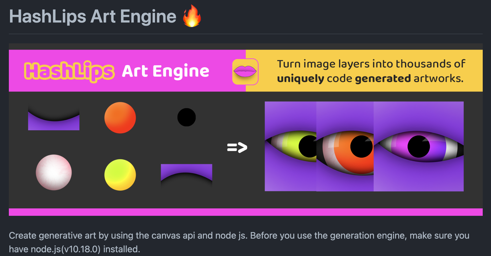

블록체인을 제테크의 개념보다 기술적인 호기심이 생겨서 직접 NFT 컬렉션을 만들고 발행할 수 있는 DApp을 만들어 봤습니다. 만드는 과정에서 기술적 가치에 한 번 놀라고 DApp이 생각보다 많은 생태계를 형성하고 있는 점에서 또 한 번 놀랐습니다. 저처럼 웹 프론트엔드 개발만 해오던 사람이 맨땅에 헤딩으로 DApp을 개발하신다면 이 글이 큰 도움이 되기를 바라면서 작성해봅니다.

## DApp

제가 처음 블록체인을 이용해서 무언가를 개발하려고 할 때 처음 들은 용어가 바로 DApp 이었습니다.

DApp은 Decentralized Application의 줄임말로 탈중앙화된 블록체인 플랫폼을 기반으로 동작하는 앱을 의미합니다. 탈중앙화된 게 어떤 의미를 가지길래 굳이 App에 D를 붙였을까요?


> 출처: https://www.researchgate.net/figure/Traditional-web-application-architecture-vs-DApp-architecture_fig2_342343000

위 사진을 보면 왜 구분짓는지 확인할 수 있을 겁니다. 일반적으로 우리가 개발해오던 방식은 데이터베이스, 백엔드, 프론트엔드로 서비스를 제공합니다. 하지만 블록체인 기반은 탈중앙화된 블록체인 네트워크에서 서비스를 제공하는 차이가 있습니다. 기업에서 관리하는 데이터 보다 투명하게 데이터를 관리하는 서비스라면 DApp이 훨씬 더 적절하다는 생각이 들었습니다.

## Smart Contract

그리고 오른쪽 그림을 보시면 Smart Contract라는 용어도 확인할 수 있습니다. 기존에 비트코인은 코인을 거래하는 기능에서 그쳤다면, 이더리움에서는 Smart Contract가 추가되어 블록체인에 기능을 부여할 수 있게되어 거래 그 이상의 서비스를 제공할 수 있게 됩니다. Solidity 개발 언어를 사용하며 다른 프로그래밍 언어 개발 경험이 있다면 쉽게 배울 수 있습니다.

## Hardhat

DApp을 개발하려면 Smart Contract 개발이 필요합니다. Smart Contarct는 Solidty 언어를 사용하는데 이를 위한 개발 프레임워크가 Hardhat 입니다. Hardhat은 배포, 테스트 기능을 제공합니다.

Solidity는 .sol 확장자로 표현하며, Ethereum Virtual Machine에 의해 컴파일되어 Ethereum Network에서 동작합니다.

```jsx
// 폴더 구조
|- contracts: contract 목록
|- scripts: contract 배포
|- tests: 작성한 contract 테스트
|- hardhat.config.ts: 메인넷, 테스트넷 등 특정 네트워크에 배포할 수 있도록 설정
```

> npx hardhat init 으로 환경 구성을 합니다.

> VSCode 사용자 라면 Solidity + Hardhat 익스텐션을 설치하여 문법 힌트 제공 받아 좀 더 편하게 개발할 수 있습니다.

## OpenZeppelin

우리가 작성해야하는 Smart Contract에도 표준이 있습니다. Ethereum Network에 한번 배포되면 수정이 안되기 때문에 위험 부담이 있습니다. OpenZeppelin은 표준 스마트 컨트랙트에서 작성해야하는 명세를 기본적으로 제공해주는 라이브러리여서 검증된 스마트 컨트랙트를 제공해주므로 해당 라이브러리를 상속 받아 사용하는 것이 일반적입니다.

> npm install --save @openzeppelin/contracts

## IPFS

탈중앙화된 파일 시스템으로, NFT를 위한 이미지, 메타데이터를 저장하는 공간입니다. 해당 네트워크는 P2P 형태이며 파일을 노드마다 나눠서 저장합니다. 여기에 올린 데이터가 영구적이진 않습니다. 파일이 사라지지 않도록 지속적으로 갱신을 해줘야하는데 이를 Pin 이라고 하는데요, 사용자는 올린 데이터가 사라지지 않도록 Pin을 해야하며 각 네트워크 노드에 이를 전달해야 유지할 수 있다는 특징이 있습니다.

이러한 과정이 번거롭기 때문에 Pinata, Infura 같은 서비스를 이용하여 Pin 관리를 대행할 수 있습니다.

IPFS를 이용해서 해당 프로토콜로 파일을 받다보면 느리다는 것을 분명히 느낄 것입니다. 아무래도 분산형이기 때문에 속도의 한계가 있지만 향후 도전과제라고 생각합니다.

이를 해결하기 위해 원본 데이터는 IPFS에 저장하고 중앙화된 서버를 구축하여 사용자에게 빠르게 데이터를 전달하는 Partially Decentralized App 형태로 개발하는 게 일반적이라고 합니다.

## Alchemy

Ethereum Node 연동, 운영을 대행해주는 서비스입니다. 이더리움 블록체인 데이터 조회, 트랜잭션 전송 등 모니터링 서비스 제공합니다. 비슷한 서비스로는 Thirdweb이 있습니다.

## Sepolia Faucet

테스트넷의 장점은 무료로 ETH를 제공합니다. https://sepoliafaucet.com/ 해당 링크를 통해서 하루에 0.5 ETH를 받을 수 있으며 이를 통해 충분히 테스팅을 할 수 있습니다.

더 유명한 테스트넷은 Goerli가 있지만, 0.001 ETH를 갖고 있는 암호 화폐 지갑에만 ETH를 지급하므로 Sepolia를 추천합니다.

## Ethers.js

브라우저와 Ethereum Network 간의 상호작용을 도와주는 라이브러리입니다.

Ethereum에서 개발한 Web3js 라이브러리를 한번 더 추상화하여 사용하기 좀 더 편했습니다.

아쉬운 점은 현재 글을 작성하는 기준으로 6.5.1 버전인데, 버전마다 제공하는 메서드명이 달라서 이 부분은 불편했습니다.


> 출처: https://101blockchains.com/web3-js-vs-ethers-js/

Web3.js와 Ethers.js 중 어느 것을 사용할 지 고민이었는데 위 표를 보고 용량도 적고 더 추상화된 Ethers.js를 선택했습니다.

## Metamask

우리가 회원가입 / 로그인해서 계정에 접근하는 방법과 달리 DApp의 경우 암호화폐 지갑으로 사용자를 인증합니다. 그 중에서 가장 점유율이 높은 게 Metamask 입니다.

Metamask는 웹 브라우저 익스텐션을 설치해야 사용이 가능하며 브라우저와 연동하기 쉽게 문서화가 잘 되어 있습니다.

https://docs.metamask.io/wallet/tutorials/react-dapp-local-state/

## HashLips Art Engine


NFT의 이미지, 메타데이터를 자동으로 생성해주는 라이브러리로 해당 라이브러리를 이용해서 이번 프로젝트에 사용할 NFT를 생성했습니다.

생성한 이미지와 메타데이터는 IPFS에 업로드하였고, NFT Collection DApp에서 민팅하면 발행하도록 구현했습니다.

https://github.com/HashLips/hashlips_art_engine

## Pixilart


NFT 이미지를 픽셀로 만드는 걸로 기획했는데 Pixilart 사이트를 이용해서 훨씬 편하게 만들 수 있었습니다.

HashLips Art Engine을 고려하여 부위 별로 나누어 이미지를 제작했습니다.

https://www.pixilart.com/

## Architecture


제가 개발한 NFT Collection DApp의 아키텍처와 개발환경을 요약한 사진입니다.

보시면 백엔드와 데이터베이스 없이 구성된 걸 확인할 수 있습니다. 이와 같이 구성된 걸 Fully Decentralized App 으로 표현합니다. 백엔드와 데이터베이스를 구성하여 개발할 수도 있는데 이를, Partially Decentralized App 이라고 합니다.

개발을 해보니 빠른 개발은 가능했지만, 백엔드와 데이터베이스가 없어서 확실히 응답속도가 느렸습니다.

## NFT 컨셉


Github Profile에 사용하는 이미지 전용 NFT를 기획했습니다. Github가 아무래도 개발자분들이 많이 사용하기 때문에 ‘개발자 밥’ 이라는 컨셉을 만들고 각 이미지 마다 유니크한 생김새를 갖고 개발 능력치를 랜덤하도록 구현했습니다.

관련 데이터는 탈중앙화된 IPFS에서 이미지와 메타데이터를 저장했으며, Pinata를 이용해서 게이트웨이로 사용했습니다.

배포한 네트워크는 실제 이더리움 네트워크를 사용하기엔 배포 비용이 커서 Sepolia 테스트넷에 배포했습니다.

### 구현 기능

**Home**

<image src='./images/home1.png'>

---

<image src='./images/home2.png'>

Smart Contract에 접근하기 위해서는 반드시 암호 화폐 지갑을 이용해서 로그인해야 합니다.

그 전에는 관련 데이터를 제공받지 않아 메타마스크를 통한 로그인을 유도하도록 구현했습니다.
**Mint**

<image src='./images/mint.png'>

로그인을 했다면 민팅 페이지로 이동할 수 있습니다.

능력치에 게이지 애니메이션을 적용하여 사용자가 랜덤한 능력치의 NFT를 갖도록 표현했습니다. Sepolia 테스트넷을 기준으로 0.01 ETH를 요구합니다.

### Assets/Id


NFT 민팅이 완료되면 최종 이미지와 메타데이터로 이루어진 능력치를 보여주게 됩니다. 좀 더 민팅 효과를 주기위해 폭죽 효과를 Canvas를 사용하여 만들었습니다. 픽셀(도트) 컨셉이어서 픽셀 폭죽을 개발했습니다.

### Assets/list


현재까지 발행한 NFT 목록을 볼 수 있는 페이지입니다. Pinata를 이용하여 탈중앙화된 데이터를 받기 때문에 응답속도가 느린 것을 확인할 수 있습니다.

## Etherscan


Etherscan을 이용한다면, 배포한 스마트 컨트랙트 나 암호 화폐 지갑 주소를 검색하여 이력을 살펴 볼 수 있습니다. 저는 Sepolia 테스트넷에 배포해서 https://sepolia.etherscan.io/ 에서 조회했습니다. 스마트 컨트랙트를 생성하고 2개의 민팅이 이뤄진 것을 확인할 수 있습니다.

## 느낀점

낯선 용어들, 낯선 개념들이 많았지만 우리가 개발해오던 아키텍처에서 그치지 않고 탈중앙화된 아키텍처를 경험해보니 시야가 훨씬 넓어졌습니다. 블록체인은 여전히 배울 것이 많지만 틈틈히 공부해가며 NFT 거래소를 개발할 예정입니다.

제가 개발한 Bob The Developer는 40개만 민팅이 가능하므로 관심있으시면 아래 링크를 통해 민팅을 체험하시길 바랍니다. 민팅하면 생각보다 기부니가 좋아져요.

https://bob-the-developer.vercel.app/
