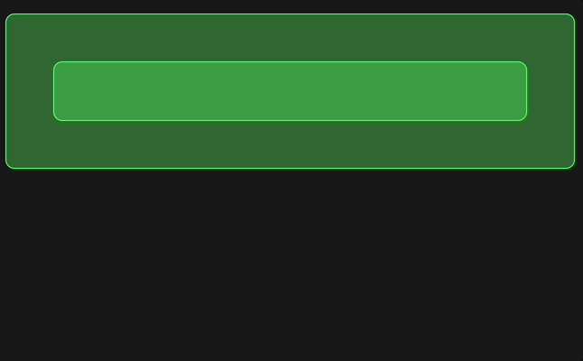
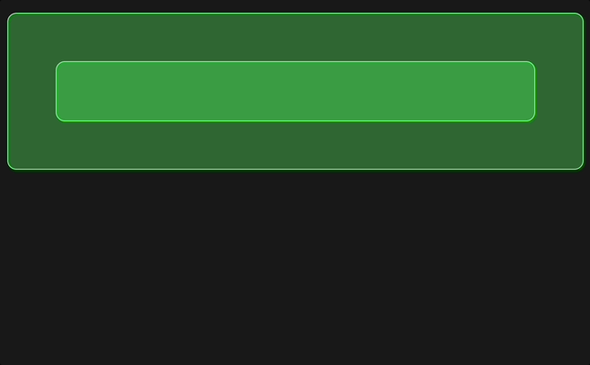
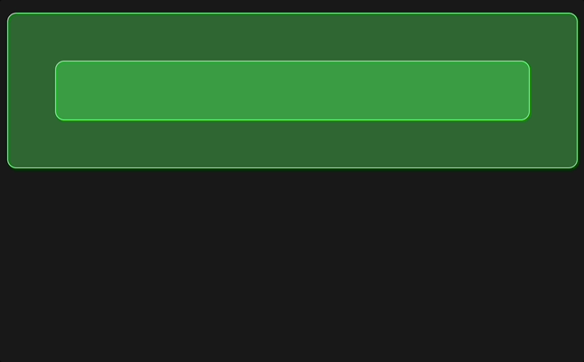

더 좋은 사용자 경험을 위해 Vue 3를 이용해서 Suspense 기능을 구현해보고 싶었습니다. 도입하면서 생각보다 고민해야할 부분이 많아 기록으로 남기게 되는데요, Vue Suspense를 도입하려는 다른 분들께 도움이 되었으면 합니다.

### Suspense는 언제 사용해야할까?

Suspense는 비동기 처리동안 렌더링 준비가 되지 않았을 때 로딩 화면을 제공하는 기능입니다.  
처음 페이지를 진입했을 때 비동기 처리 동안 사용자 경험을 개선하기 위해 사용합니다.

### Suspense 없이 구현할 순 없을까?

가능은 합니다. 하지만 Suspense를 안 쓰니 상대적으로 불편한 것이 많더라구요.


위 화면은 Suspense 없이 컴포넌트에 `loading` 상태 값을 만들어서 `v-if` 분기처리로 표현하였습니다.
하지만 로딩 상태값을 갖고있는 컴포넌트가 수만개가 되어도 괜찮을까요?  
각각의 컴포넌트가 로딩값을 갖고 있기 때문에 중앙에서 관리하고 싶을때는 쉽지 않을 것입니다.
또 UI/UX 기준으로 봤을 때 각각의 로딩 상태가 갱신되면서 팝콘이 튀어나오는(popping) 모습이 반복된다면 사용자 경험이 더 떨어져 보일 수도 있습니다.

### 그러면 써보자! Suspense

Vue에서 제공하는 Suspense를 쓰려면 아래와 같은 구조를 따라야합니다.

```vue
<Suspense>
  <!-- 비동기 컴포넌트-->

  <template #fallback>
      <!-- 로딩 상태일 때의 컴포넌트-->
  </template>
</Suspense>
```

여기서 **비동기 컴포넌트**는 무엇일까요?:

1. `Promise`를 리턴하거나 `script setup`에서 `top-level await`를 사용하는 컴포넌트
2. `defineAsyncCompoent`를 사용해서 비동기적으로 불러오는 컴포넌트

위의 두 컴포넌트 중을 사용해서 unresolve 상태이면 로딩 상태의 컴포넌트를, resolve 상태이면 의도한 비동기 컴포넌트를 렌더링하는 원리입니다.

Suspense 없이 구현했던 컴포넌트를 이번에는 Suspense를 적용해보겠습니다.


이전과 변경점은 다음과 같습니다:

1. Suspense 적용
2. 컴포넌트 내부 Spinner 컴포넌트 제거
3. 컴포넌트 loading 상태값 제거

이제 모든 비동기 컴포넌트의 상태를 보장받고 성공적으로 렌더링이 이뤄지는 것을 확인할 수 있습니다.

하지만, 조금 이상합니다. 로딩 시간이 더 길어졌습니다..

```javascript
<template>
  <Suspense>
    <Popcorn :time="3000">
      <Popcorn :time="2000"/>
    </Popcorn>

    <template #fallback>
      <Spinner/>
    </template>
  </Suspense>
</template>
```

제가 짠 구조는 이렇습니다. time값도 처음과 같습니다. 하지만 왜 로딩 시간이 더 길어졌을까요?

바로 **Async Waterfall** 때문입니다.

### 비동기 컴포넌트는 Async Waterfall을 사용한다.

제가 짠 구조를 보면 가장 처리 시간이 긴 컴포넌트는 3초입니다. 따라서 3초가 지나면 렌더링이 완료되야하는데 실제론 더 길게 로딩이 되고있습니다.

Suspense를 사용를 사용한다는 것은 비동기 컴포넌트를 사용한다는 말입니다.

**Vue에서는 부모의 비동기 컴포넌트가 완전히 resolved 상태가 되어야 자식 컴포넌트를 마운팅하기 시작합니다**

이로인해 Suspense를 사용하면 성능에 영향을 줄 수 있습니다.

Vue에서 `onCreated`는 부모 -> 자식 순서로 실행되며, `onMounted`는 자식 -> 부모 순서로 실행됩니다.

따라서 비동기 코드가 `onCreated` 시점(setup)에 실행되므로 부모 컴포넌트의 비동기 코드를 보장하려면 자식 컴포넌트가 기다릴 수 밖에 없습니다.

### Suspense의 특성이 그렇다는 건 알겠다. 하지만 좀 더 사용자 경험을 강화할 순 없을까?

부모 컴포넌트를 기다리느라 자식 컴포넌트가 늦게 마운팅되면서 자식 컴포넌트의 비동기 시간은 더 길어질 겁니다.

자식 컴포넌트의 로딩 시간이 평소에도 긴 상태인데 Suspense로 더 길어지게 된다면 사용자 경험은 오히려 더 별로일 것입니다.

Suspense를 Sub Tree로 나누어 관리한다면 이 부분을 해소할 수 있습니다.



```javascript
<template>
  <Suspense>
    <PopcornSuspense :time="3000">
      <Suspense>
        <PopcornSuspense :time="2000" />

        <template #fallback>
          <Spinner />
        </template>
      </Suspense>
    </PopcornSuspense>

    <template #fallback>
      <Spinner />
    </template>
  </Suspense>
</template>
```

위와 같은 구조 짠다면 먼저 로딩이 완료된 부모 컴포넌트를 먼저 보여줄 수 있습니다.

### Spinner 보다는 Placeholder로



Suspense를 Placeholder 컴포넌트로 사용하면 훨씬 개선된 효과를 얻을 수 있습니다. 취향차이 같기도하네요ㅎㅎ;

### 자자 결론 들어갑니다.

1. Suspense는 비동기 컴포넌트만 지원한다.
2. Suspense를 사용하면 Async Waterfall로 인해 성능에 영향을 줄 수 있다.
   (이 부분을 유의해서 도입해야합니다)
3. Suspense를 사용하면 컴포넌트별 로딩 상태를 중앙 관리하게 해준다.
4. Sub Tree를 이용해서 독립적으로 Suspense를 관리할 수 있다.
5. Suspense fallback은 Placeholder 컴포넌트가 더 좋아보인다.(개인취향)

### 참고

- [Vue Suspense — Everything You Need to Know](https://vueschool.io/articles/vuejs-tutorials/suspense-everything-you-need-to-know/)
