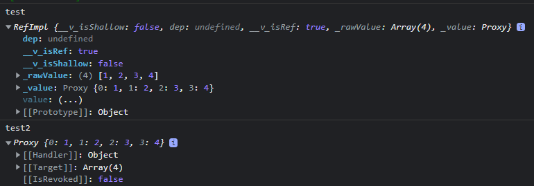

### 웹 워커에 Proxy 객체를 전달할 수 없다

웹 워커에 데이터를 전달할 때에는 `postMessage` 메서드를 사용한다.  
유의사항으로는 `postMessage` 메서드에는 아무 데이터나 다 전달할 수가 없는데, 그 중에서도 Proxy 객체를 전달할 수가 없다.

### 그게 vue랑 무슨 상관인데?

라고 생각할 수 있다. 하지만 vue에서는 데이터를 감지하여 화면을 리렌더링하는 원리에서 Proxy 패턴을 사용하기 때문에 이 부분은 유의사항이 된다.

> vue의 대표적인 반응형 변수 ref

```javascript
const count = ref(0)
console.log(count.value) // 0

count.value++
console.log(count.value) // 1
```

### 그렇다면 ref를 사용해서 워커에 데이터를 넘길 순 없는건가?

넘길 수 있다. 다만 반응형을 끊고, 프록시도 끊어야 한다.

> 먼저, vue에서 제공하는 unref를 사용하면 반응형을 제거할 수 있다

```javascript
const test = ref([1, 2, 3, 4])
const test2 = unref(test)
```



Array와 같이 참조형 변수에서는 unref를 사용하면 반응형(`RefImpl`)은 끊어지지만, proxy 객체는 유지된다.  
Number와 같은 원시형은 Proxy 객체가 유지되지 않아 바로 사용할 수 있다.

> 따라서, 참조형은 toRaw 작업을 거쳐야 비로소 사용할 수 있다.

```javasciprt
const foo = {}
const reactiveFoo = reactive(foo)

console.log(toRaw(reactiveFoo) === foo) // true
```

### 그렇다면 근본적인 문제, 왜 웹 워커에는 Proxy 객체를 전달할 수 없는걸까?

> The data may be any value or JavaScript object handled by the structured clone algorithm

웹 워커는 데이터를 전달할 때, `structured clone algorithm`을 사용해서 데이터를 깊은 복사하여 전달한다.

이 `structured clone alogorithm`은 Web API에서 제공하는 깊은 복사 메서드이며 Proxy 객체는 지원하지 않는다.

**결론은 Proxy 패턴을 사용하는 vue의 반응형 변수를 웹 워커에 전달할 때에는 유의사항이 필요하다.**

### 참고 링크

- [Vue - ref](https://vuejs.org/api/reactivity-core.html#ref)
- [Vue - unref](https://vuejs.org/api/reactivity-utilities.html#unref)
- [Vue - toRaw](https://vuejs.org/api/reactivity-advanced.html#toraw)
- [MDN - Worker.postMessage](https://developer.mozilla.org/en-US/docs/Web/API/Worker/postMessage)
- [MDN - The structured clone algorithm
  ](https://developer.mozilla.org/en-US/docs/Web/API/Web_Workers_API/Structured_clone_algorithm)
