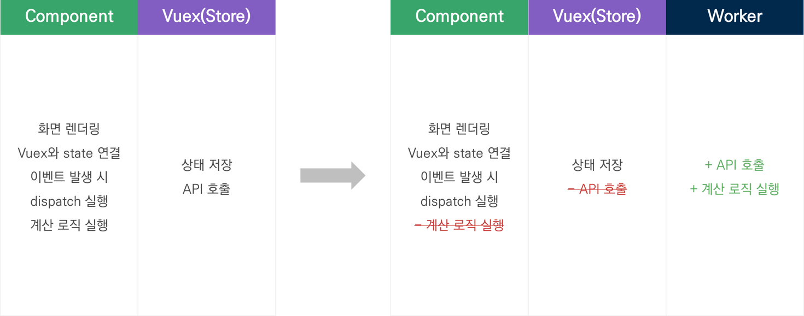

실무에서 웹 워커를 적용하면서 고민했던 내용을 기록합니다.  
실무 프로젝트에서는 `Vue 3` `Vuex` `Typescript` `Webpack 5` 환경으로 구성되어 있는 점 참고 바랍니다.

## 웹 워커를 적용한 이유

실시간으로 대용량의 데이터를 차트, 그리드로 렌더링하는 과정에서 성능 이슈가 발생하여 도입하게 되었습니다.

적용하면서 고민한 내용은:

1. 토큰 관리는 어디서 해야할까?
2. Vuex를 이용한 상태관리패턴을 유지할 것인가?
3. 메인 스레드와 워커 스레드 간의 통신 규칙은 무엇으로 정할지?
4. 비동기 처리와 동기 처리를 어떻게 지원할지?
5. 웹 워커를 위한 Composable 함수를 어떻게 제공할지?

그렇다면 이제 고민한 내용을 살펴보겠습니다.

## 1. 토큰 관리는 어디서 해야할까?

API 요청 시 토큰 인증이 필요한데 이를 위한 토큰 관리를 어느 스레드에서 할지 고민이었습니다.

### Case 1. Session Storage

- API 요청 시 필요한 권한 토큰을 Session Storage에서 관리하는 방식입니다.
- Web Worker에서 API 요청을 할 때 마다 Access Token을 넘겨줘야합니다.
- Access Token 권한 만료 동기화를 일치시킬 수 있습니다.
- 새로고침 시 Token을 유지시킬 수 있습니다.

### Case 2. Worker

- 토큰을 Web Worker에서 관리하는 방식입니다.
- 토큰을 Web Worker에서 관리하기 때문에 보안상 유리합니다.
- 새로고침 시 매번 Token API를 요청해야합니다.

### Case 3. Session Storage + Worker

- 토큰을 Session Storage와 Web Worker 둘 다 갖고있는 방식입니다.
- Web Worker에 매번 토큰을 넘길 필요가 없습니다.
- 토큰을 Session Storage에 저장하기 때문에 새로고침 시 토큰이 유지됩니다.
- 관리 주체가 두곳이어서 관리 포인트가 늘어납니다.

### 결론

**Case 1. Session Storage**를 선택했습니다.

그 이유는:

1. 새로고침 시 토큰이 유지된다.
2. 토큰을 워커에 매번 넘기는건 적은 비용이다.
3. 두 스레드간의 토큰이 일치하도록 유지된다.
4. 현재 프로젝트와 유사한 구조이다.

## 2. Vuex를 이용한 상태관리패턴을 유지할 것인가?

프로젝트에서 Vuex를 사용하여 개발하고 있기 때문에 위와 같은 상태관리패턴을 적용하고 있는 상태이다. 하지만 웹 워커를 도입한다면 어떤 패턴을 적용해야할지 고민이었습니다.

### Case 1. 웹 워커, Vuex 분리

- 웹 워커와 Vuex를 분리한 패턴입니다.
- fetch, 응답 데이터는 웹 워커에서 관리합니다.
- Vuex에서는 서버 응답데이터를 제외한 State를 관리합니다.

### Case 2. 웹 워커 + Vuex

- Vuex를 거쳐서 웹 워커를 동작시키는 방식입니다.
- 기존 방식에 상태관리패턴에서 웹 워커만 추가된 패턴입니다.
- 상태관리는 Vuex, 로직 처리는 웹 워커에서 수행합니다.

### Case 3. 웹 워커에서 Vuex 만들기

- 웹 워커 내부에 Vuex를 만들어서 관리하는 방식입니다.
- [참고링크](https://logaretm.com/blog/vuex-off-main-thread/#nature-of-javascript)

### 결론

**Case 2. Vuex를 거쳐서 웹 워커를 동작시키는 방식**을 선택했습니다.

이유는:

1. 코드에서 Vuex를 dispatch 했을 때 내부 동작은 모른채로 예상한 기대값을 받아서 처리하고 있습니다. 이러한 흐름을 봤을 때 dispatch의 내부 동작을 웹 워커 코드로 수정한다면 짜여진 코드를 수정할 일이 적습니다. 여전히 코드단에서는 dispatch의 내부 동작을 신경쓰지 않고 사용할 수 있게 됩니다.
2. 웹 워커에서 처리한 데이터를 state를 저장하기 때문에 다양한 컴포넌트에서 접근이 가능합니다.

## 3. 메인 스레드와 워커 스레드 간의 통신 규칙은 무엇으로 정할지?

메인 스레드와 워커 스레드 간의 데이터를 주고받을 때 명확한 규칙 필요성을 느꼈습니다.  
[이전에 공부한 내용](http://wani.dev/Web%20Worker/message-passing/)을 토대로 JSON-RPC 방식에 착안하여 워커스레드에 method, params를 Object 형식으로 전달하는 패턴과 명령 분배 패턴을 적용했습니다.

## 4. 비동기 처리와 동기 처리를 어떻게 지원할지?

웹 워커를 적용하면서 가장 주의한 부분은 '웹 워커의 비동기 처리를 메인 스레드에서 기다리지 않도록 구현해야겠다' 였습니다. 그 이유는 위의 사진처럼 웹 워커의 비동기 처리를 기다리는 동안 메인 스레드는 블로킹 상태가 되기 때문입니다. 제가 느끼기에는 반쪽짜리 멀티 스레드처럼 보였습니다.  
하지만 막상 적용해보니 동기적으로 수행해야하는 케이스가 존재해서 골머리였습니다.

비동기 로직을 실행하는 `execute` 함수의 실행 시점을 제어할 수 있도록 만들어서 비동기 처리와 동기 처리를 둘 다 지원하도록 해결했습니다.

## 5. 웹 워커를 위한 Composable 함수를 어떻게 제공할지?

이제 모든 고민들이 해결되가고 있었습니다. 하지만 기존 코드에 워커를 적용하는 거라 이를 바꿀 때의 시간적인 비용이 많이 소요될 것 같았습니다. 저는 이를 줄이기 위해서 Composable 함수를 따로 만들었는데요, React에서 Custom hook이 있다면 Vue에서는 Composable 이라는 용어로 사용하고 있습니다.

**Composable 이란?**

> Vue Composition API에서 재사용 가능한 로직을 캡슐화하여 제공하는 함수입니다.  
> [참고 링크](https://vuejs.org/guide/reusability/composables.html)

`useAsync` 함수를 합성하여 워커에서 처리하는 데이터, 로딩, 에러, 실행 함수를 제공하여 반복되는 코드를 재사용할 수 있도록 개발했습니다.  
이로 인해 기존 코드에서 수정 작업을 할 때 수월하게 작업할 수 있었습니다.

## 마치며

### 성능 개선

실시간 모니터링 화면의 FPS가 50 -> 60을 유지하는 것을 확인할 수 있었습니다. 또, 대용량 데이터 처리 시 발생하던 성능 이슈를 개선할 수 있었습니다.

### 모호한 역할에 대한 기준 확립

최종적으로 기존에 Vuex에서 담당하던 계산 로직, API 호출을 웹 워커에 위임한 모습으로 바뀌었습니다. 이 과정에서 팀원분들과 협의되지 않았던 역할군에 대해 확립하는 계기가 되었습니다.

### 아쉬운 점

API 요청하는 역할은 워커가 하지말고, 계산 로직만 수행하는 방법을 적용했다면 어땠을까 아쉬움이 남습니다. 생각보다 API 요청, 응답 과정에서 많은 전처리가 들어가는데 이를 워커 스레드에서 관리하는 게 힘들었습니다. 버그 핫스팟이 전처리 과정이었습니다😂

### 느낀 점

Vue를 사용하면서 웹 워커를 사용한 사례가 없어서 힘들었습니다. 그 밖에 TypeScript, Webpack5도 고려하다보니 환경 구성부터 예상치 못한 에러가 많았습니다.  
다행히 책과 인터넷을 뒤져가며 많은 시행착오 끝에 고민했던 부분을 해결할 수 있었습니다.
