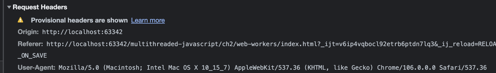
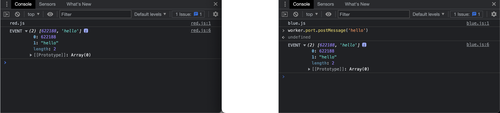

실무 적용을 위해 브라우저에서 제공하는 멀티스레딩 API 인 웹 워커를 정리한 글 입니다. 웹 워커는 CPU 부하량이 높은 작업을 별도의 스레드에서 처리할 수 있다는 장점이 있습니다. 그러면 메인 쓰레드는 UI 렌더링에 더 집중하여 안정적인 FPS(Frame Per Second)를 유지할 수 있습니다. 결과적으로 사용자에게 더 좋은 웹 페이지 경험을 제공할 수 있습니다!  
프론트엔드 프레임워크에 삼대장이 있듯, 워커도 삼대장이 있습니다. 물론 점유율도 다양하구요. 하나씩 정리해봅시다.

## 1. 전용 워커 (Dedicated Worker)

단일 스크립트에서만 사용하는 스레드입니다. 보통 워커를 구현한다고 했을 때 가장 많이 사용하며 적용 또한 단순합니다. 메시지 패싱(message passing) 방식으로 메인 스레드와 워커 스레드가 서로 통신을 합니다.

### 예시 코드

```javascript
// main.js
const worker = new Worker('worker.js')

worker.onmessage = msg => {
  console.log(msg.data)
}

worker.postMessage('main → worker')
```

- onmessage 이벤트 핸들러의 인자는 MessageEvent 객체로써 data 속성에 워커가 보낸 메시지가 담겨있습니다
- postMessage 함수의 인자는 Structured clone algorithm 을 사용하여 깊은 복사된 데이터를 전달합니다
- Structured clone algorithm 은 지원하는 타입이 정해져있어서 [여기](https://developer.mozilla.org/en-US/docs/Web/API/Web_Workers_API/Structured_clone_algorithm#supported_types)를 참고하면 좋을 것 같습니다

```jsx
// worker.js
self.onmessage = msg => {
  console.log(msg.data)

  postMessage('worker → main')
}
```

- 여기는 worker 영역입니다! 저는 주술회전에서 영역 전개🙏라고 생각하니까 좀 더 이해가 편했습니다.
- self 는 워커 스레드의 전역 객체인 globalThis 를 의미합니다.

```text
// Console
main → worker
worker → main
```

- 결과적으로 콘솔에서는 위와 같은 순서로 로그가 나타납니다
- 예시 코드에서는 단순하게 받은 데이터를 출력만 했지만, 궁극적으로는 아래 흐름과 같이 구현하는게 목표입니다.
- 메인 스레드에서 워커 스레드에 데이터 전달 → 워커 스레드에서 데이터 처리 후 메인 스레드에 데이터 전달 → 전달받은 데이터를 메인 스레드에서 활용

### 워커 메서드

worker.postMessage

- 워커에 메시지를 보내는 함수입니다.
- postMessage 함수가 호출되면 워커의 self.onmessage 에 메시지가 전달됩니다.

worker.onmessage

- 워커의 self.postMessage 함수가 호출되고 나서 메인 스레드에서 실행되는 함수 입니다.

worker.onerror

- 워커에서 발생한 에러를 처리하는 함수입니다.
- 인자로 ErrorEvent 객체를 전달 받습니다.
- 해당 메서드의 존재를 모르고 있었는데 워커에서 에러가 발생해도 아무 반응이 없어서 힘든 경험이 있습니다.

worker.onmessageerror

- worker.postMessage 에서 전달한 메시지가 역직렬화되지 않은 경우 발생합니다.

worker.terminate

- 워커를 종료시키는 함수입니다.

### 워커 생성자 함수

워커를 생성하려면 아래와 같이 생성자 함수를 사용합니다. 각 인자를 살펴보겠습니다.

```javascript
const worker = new Worker(filename, options)
```

filename: 워커가 동작할 코드의 URL 을 작성합니다. 동일 출처 정책을 따르기 때문에 같은 Origin 의 URL 만 가능합니다.

options: 객체 타입으로 워커의 여러 옵션을 지정할 수 있습니다.

- type: 디폴트값은 classic 으로 일반적인 자바스크립트 파일을 나타내지만, module 은 ECMAScript 모듈을 나타내어 module 로 선언 시, 외부 코드를 import 할 수 있습니다.
- credentials: 워커 파일을 로드할 때, HTTP 자격증명을 포함할 지 결정합니다. type 이 module 인 경우에만 사용됩니다.

  - omit: 디폴트값, 자격증명을 항상 제외
  - same-origin: 동일한 Origin 일 경우에만 자격증명 전송
  - include: 항상 자격증명 전송

  
  자격증명 활성화 후 아무 정보없이 요청하면 위와 같은 경고 메시지가 발생된다

### 워커 특징

- importScripts 함수를 통해 워커 영역에서 외부 코드를 불러올 수 있습니다.
  (워커 생성자의 두 번째 인자 options: type 을 module 로 선언해야 합니다)
- 워커는 DOM 에 접근할 수 없습니다.

## 2. 공유 워커(Shared Worker)

공유 워커는 윈도우 창, iframe 등 다른 브라우저 환경에서 접근 가능한 워커입니다.

공유 워커의 특징은 공유 워커를 생성한 컨텍스트가 종료되어도 다른 브라우저 환경이 존재한다면 공유 워커는 여전히 존재한다는 것입니다.

예시로 red.html 과 blue.html 에서 공유 워커를 사용하는 코드를 작성해봤는데요, 아래와 같습니다

### 예시 코드

```javascript
// red.js
console.log('red.js')

const worker = new SharedWorker('shared-worker.js')

worker.port.onmessage = event => {
  console.log('EVENT', event.data)
}
```

```javascript
// blue.js
console.log('blue.js')

const worker = new SharedWorker('shared-worker.js')

worker.port.onmessage = event => {
  console.log('EVENT', event.data)
}
```

```javascript
// shared-worker.js
const ID = Math.floor(Math.random() * 999999)
console.log('shared-worker.js', ID)

const ports = new Set()

self.onconnect = event => {
  const port = event.ports[0]
  ports.add(port)
  console.log('CONN', ID, port.size)

  port.onmessage = event => {
    console.log('MESSAGE', ID, event.data)

    for (let p of ports) {
      p.postMessage([ID, event.data])
    }
  }
}
```


결과를 보면 blue.js 에서 생성한 워커에 ‘hello’ 문자열을 전달하였지만 red.js 에도 동일한 ID, data 가 출력되는 것을 확인할 수 있습니다.

## 3. 서비스 워커(Service Worker)

서비스 워커는 웹 사이트의 캐시를 관리하기 위한 워커입니다.

여러 개의 페이지와 연결할 수 있다는 점에서 공유 워커와 비슷합니다.

네트워크 연결이 끊겼을 때 브라우저가 정상적으로 웹페이지를 보여줄 수 있도록 캐시된 데이터를 서비스 워커가 리턴하는게 대표적인 용도입니다.

### 예시 코드

```javascript
// main.js
navigator.serviceWorker.register('service-worker.js', { scope: '/' })

// contorllerchange 이벤트 리스너
navigator.serviceWorker.oncontrollerchange = () => {
  console.log('controller change')
}

// 요청 함수
const makeRequest = async () => {
  const result = await fetch('/data.json')
  const payload = await result.json
  console.log(payload)
}
```

- 전용 워커와 공유 워커를 생성하는 방식이 다른 점이 상당히 낯섭니다;;
- 서비스 워커는 navigator.serviceWorker 라는 객체를 통해 생성합니다
- scope 속성은 서비스 워커의 제어 범위를 의미합니다. 디폴트 값은 서비스 워커가 로드되는 디렉터리 위치입니다. 예시 코드에서는 `‘/’` 이므로 서비스 워커가 모든 범위를 제어하네요~

```javascript
// service-worker.js
let count = 0

self.oninstall = event => {
  console.log('service worker install')
}

self.onactivate = event => {
  console.log('service worker activate')
  event.waitUntil(self.clients.claim())
}

self.onfetch = event => {
  console.log('fetch', event.request.url)

  if (event.request.url.endsWith('/data.json')) {
    count++
    event.respondWith(
      new Response(JSON.stringify({ count }), {
        headers: {
          'Content-Type': 'application/json',
        },
      })
    )
    return
  }

  event.respondWith(fetch(event.request))
}
```

- count 는 동작 확인을 위한 변수로 만들었습니다.
- oninstall 메서드는 서비스 워커가 브라우저에 설치되었을 때 호출됩니다.
- onactivate 메서드는 새로운 서비스 워커가 활성화 되었을 때 호출됩니다. 해당 시점에서 오래된 캐시를 삭제하는 작업을 수행하기도 합니다.
- self.clients.claim 함수는 서비스 워커를 등록한 페이지, 즉 register()를 호출했던 index.html 에 대한 제어권을 부여받습니다. 해당 코드가 없다면 서비스 워커는 활성화되지 않습니다.
- 워커의 이벤트 핸들러 비동기 함수가 아니어서 promise 를 반환하는 self.clients.claim 함수에 await 을 사용할 수 없습니다. 하지만 event.waitUntil 을 사용하여 promise 처리할 수 있습니다.
- onfetch 메서드는 서비스 워커가 제어권을 갖는 페이지에서 네트워크 요청이 발생할 때마다 호출됩니다.
  해당 코드에서는 `/data.json` 으로 주소가 끝나는지 확인하여 응답을 JSON 형식으로 전달받을 것을 의미합니다. 그외의 요청에는 fetch 처리를 합니다.


- 작성한 코드 환경의 브라우저에서 개발자 도구를 키고 data.json 을 요청하는 makeRequest 함수를 호출하면 위와 같이 서비스 워커가 네트워크 요청을 가로채서 특정 요청에 대한 처리를 할 수 있습니다.
- Axios 라이브러리의 interceptor 의 기능과 상당히 유사합니다.

### ServieceWorker.state

parsed

- 서비스 워커가 시작될 때의 상태입니다. 서비스 워커의 JS 파일이 파싱됩니다.

installing

- 서비스 워커가 설치중인 상태입니다.
- 새로운 서비스 워커가 업데이트될 때마다 발생합니다
- onInstall 핸들러가 호출되고 event.respondWith 가 resolve 되기 전의 상태입니다.

installed

- 서비스 워커 설치가 완료된 상태입니다.
- 설치가 완료되면 onactivate 핸들러가 호출됩니다.

activating

- onactivate 핸들러가 호출되고 event.respondWith 가 resolve 되기 전의 상태입니다.

activated

- 서비스 워커가 활성화된 상태입니다. fetch 이벤트를 수행할 수 있는 단계입니다.

redundant

- 새로운 스크립트가 로드된 상태입니다.

## 마치며

이번에 웹 워커를 실무에 적용하기 앞서 이론적인 공부를 해봤는데요, 사실 저는 전용 워커만 사용해본 적이 있고 다른 공유 워커와 서비스 워커는 필요성을 못 느껴서 사용한 적이 없습니다. 이번 글에서는 웹 워커들을 종류별로 찍먹해본 느낌에 가깝습니다. 다음 글에서는 메인 스레드와 워커 간의 메시지 패싱에 관하여 정리하겠습니다. 훈수는 항상 환영합니다🤗
